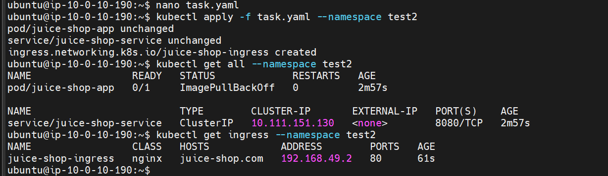
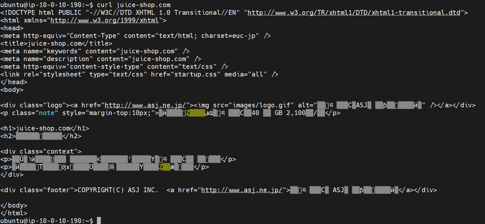

# Devops-Task

# Task_1 Result
The 325 of john@domain.com is ODD
The 131 of jane@domain.com is ODD

# Task_2 Result
# Instructions
## 1- Create namespace on kuberenetes cluster
```$ kubectl create namespace test```
## 2- Create pod with image ```image=bkimminich/juice-shop```

## 3- Expose pods to port 8080 inside the cluster using ```juice-shop-service```

## 4- Expose pods outside cluster using ingress 
```kubectl apply -f task.yaml --namespace test```
This will create an ingress service that connects the juice-shop service to the domain "juice-shop.com" 


